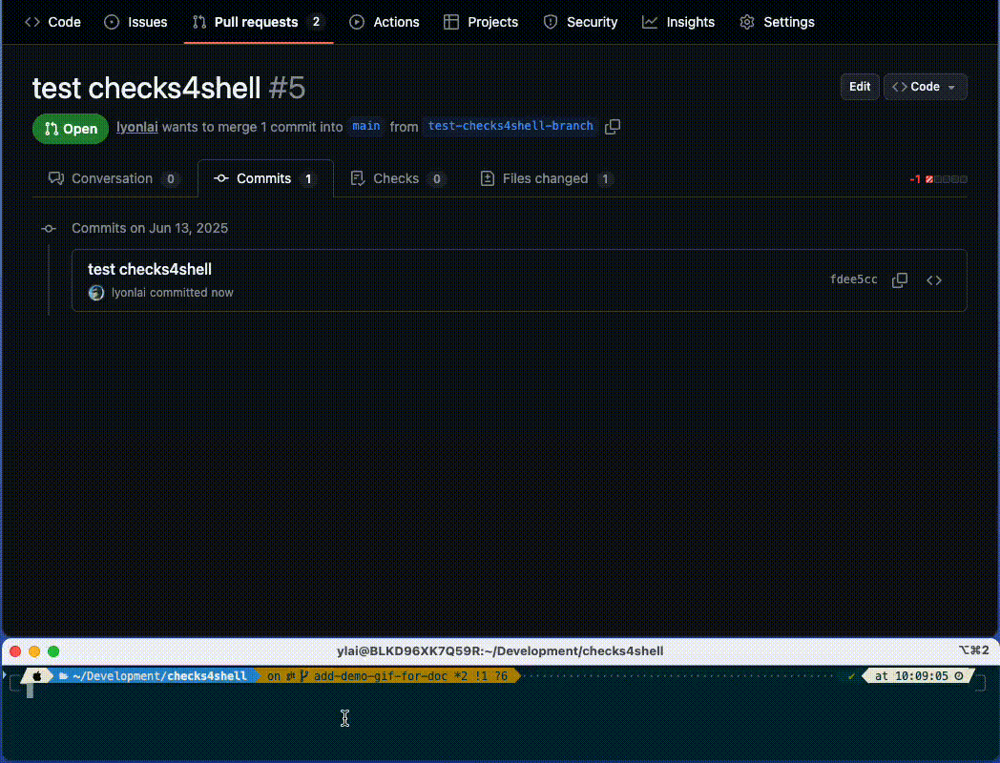

# checks4shell
`checks4shell` is a command line tool aim to simplify the process of making command line execution feedback up to GitHub commit via its [Checks API](https://docs.github.com/en/rest/checks?apiVersion=2022-11-28).



## Usage
A view of how checks4shell will be used from the command line is like the following

```shell
checks4shell run \ 
    --github-app-private-key private-key.pem \ 
    --github-app-id 12345 \ 
    --github-app-installation-id 678910 \ 
    -o owner \ 
    -r repo \ 
    -c commit \ 
    -n name-of-the-check \ 
    -t title-of-the-check \
    ... other optional parameters ... \ 
    -- {shell-command} {arguments...}
```

It runs the shell command with arguments, and sending the output to GitHub Checks API as the output details. 
When the command finishes it also wraps up the status and send the last update to GitHub Checks API.

### Authentication, local run & debugging 
The `--github-*` related parameters manages the GitHub App authentication. Checks API can only be called by using GitHub App.

If authentication is not provided the command will just run the shell command with its arguments, making it easy to test out.

There is also a `--debug` option give you more information under this situation. It prints out the params going to be sent to GitHub Checks API.

### Command Verboseness & Environment Variables
Invocation supplying all arguments necessary for the GitHub checks API as you can see from the above, is very verbose.
Making it available cross multiple scripts in a pipeline could be challenging. 

However, the majority of the parameters, except debug flag, shell command and its arguments, can be fed in via environment variables.

All environment variables are prefixed by `CHECKS4SHELL_`, you can do `checks4shell run --help` to see the full list.

With all required parameters supplied by environment variables, the command can be shorted to as the following

```shell
checks4shell run -- {shell-command} {arguments...}
```

### Dealing with attributes with large content
In GitHub Checks API, there are attributes that can either take large content, or it could be a large list of elements.
Either situation will make it hard to fill out the command line. However, there are ways to deal with it.

#### Summary
Summary section in GitHub checks can take large amount of text. This might be hard to do in shell scripts. 
`checks4shell` can take a file name for summary and load the summary content from it.

#### Images and Annotations
A list of images and annotations can be supplied to the GitHub Checks API. But it will be lots of work to load via CLI parameters.
Instead, a directory could be supplied to either the images or annotations parameter. All `.json` files will be loaded in lexical order,
parsed to respective structures and send up to GitHub Checks API.

For the details of the JSON struct, please check out [CheckRunImage](https://github.com/google/go-github/blob/662da6f8e9f32b7da649ad0bfac19948e5acdd85/github/checks.go#L64) and [CheckRunAnnotation](https://github.com/google/go-github/blob/662da6f8e9f32b7da649ad0bfac19948e5acdd85/github/checks.go#L51).
